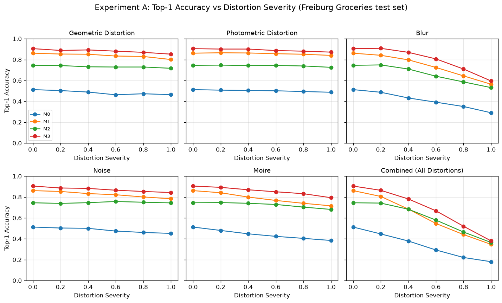
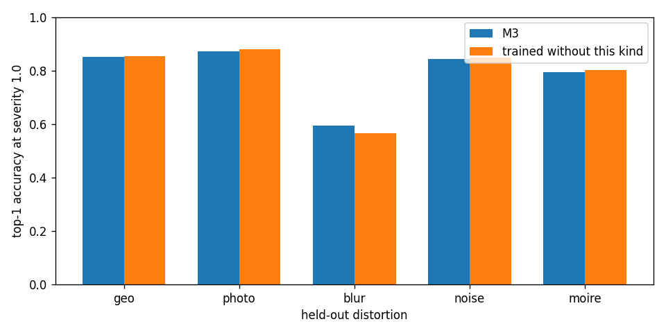
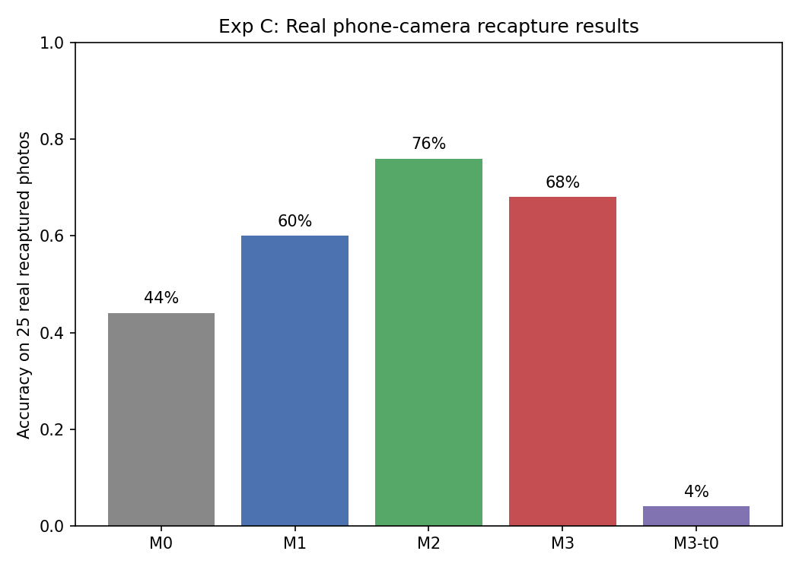

# Camera-robust recognition

Does an adversarial augmentor and text-anchored CLIP features, the mechanism behind [TIACam](#references)'s camera-robust watermarking (Tanvir, Dasgupta, and Zhong, 2026), also make product recognition hold up under camera distortion? Tested end to end, including a real phone-camera recapture, not just simulation.

Trained and tested on Freiburg Groceries: 25 classes, 988 test images.

## Models

| | |
| --- | --- |
| **M0** | Zero-shot CLIP |
| **M1** | Linear probe on frozen CLIP features |
| **M2** | Same head, fixed random augmentation |
| **M3** | Head trained against the augmentor |
| **M3-t0** | M3 with the text loss turned off |

## Headline numbers

- Clean M3 accuracy: **90.5%**
- Combined severity 1.0: M3 **38.0%**, M2 **36.4%**, M1 **34.6%**, M0 **18.0%**
- Phone recapture (25 photos): M2 **76.0%**, M3 **68.0%**

## Results

Severity 0.0 is the clean image. Severity 1.0 is the strongest distortion in the sweep. Accuracies below are the values in `results/expA_sweeps.csv` and `results/recapture_seed0.csv`, shown to one decimal place.

### Experiment A — distortion sweep

| Model | Clean | Geo 1.0 | Photo 1.0 | Blur 1.0 | Noise 1.0 | Moire 1.0 | Combined 1.0 | Phone recapture (n=25) |
| --- | --- | --- | --- | --- | --- | --- | --- | --- |
| M0 | 51.2% | 46.4% | 48.7% | 29.0% | 45.1% | 38.4% | 18.0% | 44.0% |
| M1 | 86.1% | 80.1% | 84.0% | 56.4% | 78.3% | 71.6% | 34.6% | 60.0% |
| M2 | 74.5% | 71.7% | 72.6% | 53.1% | 74.4% | 68.1% | 36.4% | 76.0% |
| M3 | 90.5% | 85.2% | 87.1% | 59.5% | 84.3% | 79.4% | 38.0% | 68.0% |
| M3-t0 | 3.2% | 3.2% | 3.2% | 3.2% | 3.2% | 3.2% | 3.2% | 4.0% |

Clean accuracy is the severity 0.0 row. It is the same number for every kind of a given model in `results/expA_sweeps.csv`. M3-t0 stays at 3.2% for every kind and every severity in that file.



*Top-1 accuracy on the Freiburg test set as severity goes from 0 to 1, one panel per distortion.*

### Experiment B — leave-one-out

At severity 1.0, from `results/expB_leaveout.csv`, shown to one decimal place. M3-drop was trained with the other four ops and then tested on the one it never saw.

| Held out | M3 | M3-drop |
| --- | --- | --- |
| geo | 85.2% | 85.3% |
| photo | 87.1% | 88.0% |
| blur | 59.5% | 56.7% |
| noise | 84.3% | 84.8% |
| moire | 79.4% | 80.1% |



*Full M3 next to the head trained without that distortion, both scored at severity 1.0.*

### Experiment C — phone recapture



*Accuracy of each model on the 25 photos recaptured with a phone.*

### Experiment E: Semantic Margin Analysis

Does the feature displacement measured in the feature-space run actually damage class separability, or only move the vector? Same 25 matched clean, simulated, and real triplets, same M2 and M3 checkpoints, same frozen CLIP backbone, and the same 25 text anchors.

For every model, image, and condition, the head feature is scored against all 25 anchors. Each sample records the correct-class similarity, the nearest wrong-class similarity, the predicted class, and the semantic margin: correct similarity minus nearest-wrong similarity. Before any of the numbers below were used, real-recapture accuracy from those anchor scores was checked against Experiment C. It matched exactly: M2 76.0%, M3 68.0%.

Mean semantic margin on the 25 triplets:

| Model | Clean | Simulated | Real |
| --- | --- | --- | --- |
| M2 | 0.0746 | −0.0327 | 0.0453 |
| M3 | 0.1673 | −0.0433 | 0.0493 |

Margin drop from the clean image:

| Model | Simulated drop | Real drop | Real drop, relative to clean |
| --- | --- | --- | --- |
| M2 | 0.1074 | 0.0294 | ~39% |
| M3 | 0.2106 | 0.1181 | ~71% |

M3's clean margin is already more than double M2's, so the larger absolute drop on its own is not conclusive. The relative drop, about 71% against about 39%, still has M3 losing proportionally more margin on the phone photos. That lines up with Experiment C, where M2 beat M3 on the real recaptures even though M3 was ahead under simulated distortion.

On the below-median half of the real-recapture distances, ranked by margin drop, one M3 case stands out: `tomato_sauce`. Its clean-to-real distance is below the median (0.119) and the margin falls by about 67%, from 0.262 to 0.088, while the prediction stays correct. A soda sample was left out of that list because it was already wrong on the clean image, so that error is not damage from the shift.

Preliminary, n=25:

- M3 loses more semantic margin than M2 on the real recaptures, in both absolute and relative terms.
- A small feature shift can still take most of the margin. `tomato_sauce` is one clear case: below-median displacement, majority loss of margin, prediction unchanged. That is one observation, not a pattern.
- Distance does not by itself explain classification risk. None of the small-displacement cases flipped to a wrong class, but several lost most of their margin, so that erosion is invisible if only accuracy is checked.
- These are small-sample observations. They are not proof, and they are not a claim that the augmentor overfit.

`analyze_semantic_margin.py`, `check_interesting_cases.py`. Tables and plots: `results/semantic_margin_metrics.csv`, `results/distance_vs_margin_m2.png`, `results/distance_vs_margin_m3.png`, `results/interesting_cases_m2.csv`, `results/interesting_cases_m3.csv`.

## Method

The encoder is a frozen OpenAI CLIP ViT-B/32 at 224 px. Its feature space already sits next to text, so the backbone stays fixed. The head is a residual network on those 512-d features, L2-normalized. The augmentor, following [TIACam](#references) (Tanvir, Dasgupta, and Zhong, 2026), is trained by gradient ascent on the invariance loss: it looks for a setting of perspective, colour, blur, noise, and moire that hurts this head, instead of drawing a random augmentation. Class names are encoded as text anchors and the head is pulled toward the right anchor with cross-entropy. Without that term the head collapses: M3-t0 never leaves 3.2% on the test sweep. M2 uses the same head and the same families of distortion, but the augmentation is fixed and random, so the two runs separate the learned search from plain augmentation.

## Latency

Median time for one 224 px image through CLIP and the M3 head, 200 timed runs after 20 warmup runs (`results/latency.csv`).

| Device | Median |
| --- | --- |
| GPU | 6.34 ms |
| CPU | 147.00 ms |

## Limitations

Exp C used only 25 photos, so an 8-point gap between models is not something to make strong claims about. M3 beats M0 and M1 on the synthetic sweeps, and beats M2 on Exp A. On Exp B the full model and the held-out model are close at severity 1.0, and blur is the only held-out kind where full M3 is higher (59.5% against 56.7%). On the phone recapture M2 is ahead of M3, 76.0% against 68.0%. Those photos are a screen recapture, not a live camera, and the training images are a public grocery set.

## Reproduce

```
python prep_data.py --seed 0
python train_baselines.py --seed 0
python train_ours.py --seed 0 --epochs 15
python train_ours.py --seed 0 --lam_text 0 --epochs 15
python train_ours.py --seed 0 --epochs 15 --ops geo,photo,noise,blur
python train_ours.py --seed 0 --epochs 15 --ops moire,photo,noise,blur
python train_ours.py --seed 0 --epochs 15 --ops moire,geo,noise,blur
python train_ours.py --seed 0 --epochs 15 --ops moire,geo,photo,blur
python train_ours.py --seed 0 --epochs 15 --ops moire,geo,photo,noise
python eval_recognition.py --seed 0
python plot_results.py --seed 0
python select_recapture_images.py --seed 0
python eval_recapture.py --seed 0
```

## References

Tanvir, A. A., Dasgupta, A., and Zhong, X. (2026). TIACam: Text-Anchored Invariant Feature Learning with Auto-Augmentation for Camera-Robust Zero-Watermarking. arXiv:2602.18863.

Jund, P., Abdo, N., Eitel, A., and Burgard, W. (2016). The Freiburg Groceries Dataset. arXiv:1611.05799.

Radford, A., Kim, J. W., Hallacy, C., et al. (2021). Learning Transferable Visual Models From Natural Language Supervision. ICML. (CLIP, used here as the frozen backbone.)
